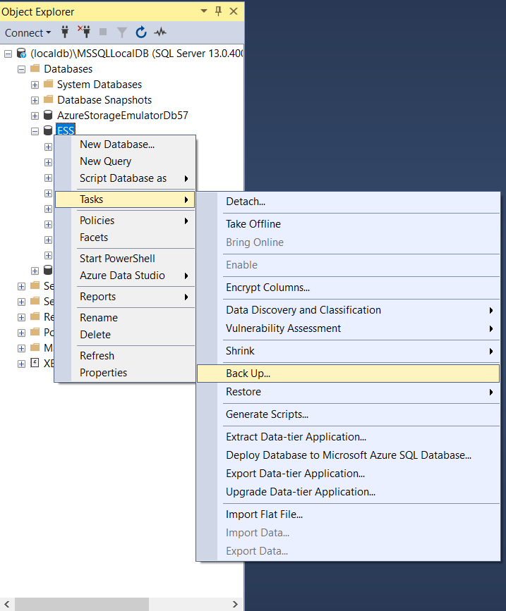

# Performing Manual Database Backups and Restores

## Backup Database
1. Connect to Database Pod
2. Open Data management tool to the table such as Sql Server Management Studio (SSMS) or Azure Data Studio (ADS)
3. On SSMS 
   <ul>
        <li>Right-Click on Database and select <b>Tasks</b> -> <b>Backup Database</b></li> 
         
        <li>Ensure <b>Database</b> is selected as a <u>Backup component:</u></li>
        <li>Select <u>Destination</u> as a <u>Back up to:</u> <b>Disk</b> and click <b>Add</b></li>
        <li>In the popup, enter the <i>file name</i>, then click <b>Ok</b></li><li>Then click <b>Ok</b> on the main <i>Backup Up Database</i> window</li>
    </ul>
        
    On ADS
    <ul>    
        <li>Right-Click on Database and select <b>Backup</b></li>
        <li>Enter a <i>Backup Name</i></li>
        <li>Remove the current backup file by selecting and clicking "-", then click "+" to enter a new specific backup file</li>
        <li>Click <b>Backup</b> button</li>
    </ul>

## Restore Database
1. Connect to Database Pod
2. Open Data management tool to the table such as Sql Server Management Server or Azure Data Studio
3. 